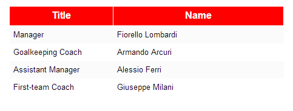
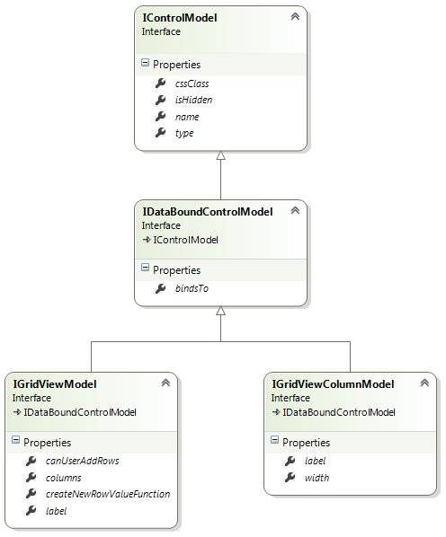
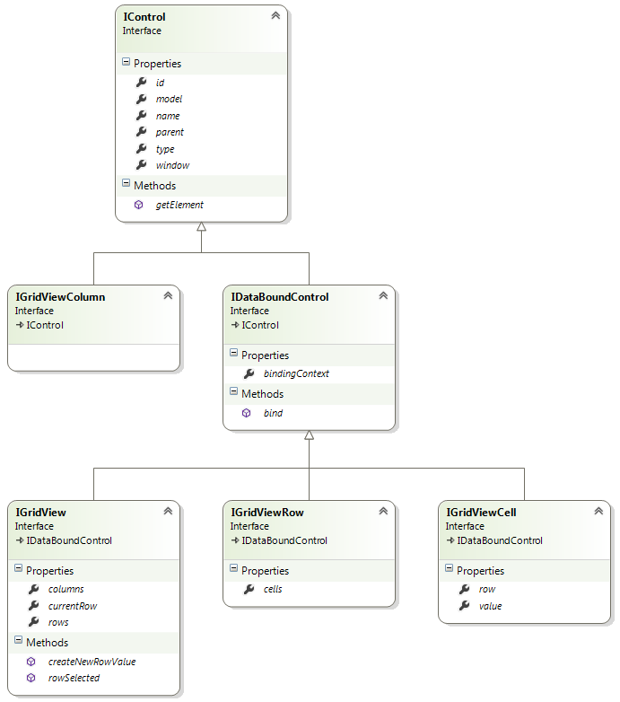

# GridView Control

## Model

**type: string** - type of the control. Use _"gridview"_ to declare a GridView control.

**name?: string** (optional) - name of the control. In javascript code, a child control is accessible from its parent control by name. In HTML, the value is put into the _name_ attribute of the element.

**cssClass?: string** (optional) - custom CSS class that will be applied to the control's outer element.

**isHidden?: boolean** (optional) - allows to declare control as hidden.

**bindsTo?: string** (optional) - path of the property that the control will be databound to.

#### IGridViewModel Properties

**label?: string** (optional) - control label.

**columns?: IGridViewColumnModel** (optional) - describes grid view columns.

**canUserAddRows?: boolean** (optional) - specifies whether user can add rows. Default value is True.

**createNewRowValueFunction?: string** (optional) - path to the function that creates a new row. Function has to be declared on a databound object. If _canUserAddRows_ is set to true, this value should be provided.

#### IGridViewColumnModel Properties

**label?: string** (optional) - column label.

**width?: number** (optional) - column width.

### Example

{code:javascript}
{
	"name": "managersGrid",
	"type": "gridview",
	"bindsTo": "list",
	"canUserAddRows": false,
	"columns": [
		{
			"type": "gridviewstatictextcolumn",
			"name": "title",
			"label": "Title",
			"width": 150,
			"bindsTo": "title"
		},
		{
			"type": "gridviewstatictextcolumn",
			"name": "name",
			"label": "Name",
			"width": 250,
			"bindsTo": "name"
		}
	]
}
{code:javascript}

## Control

**model: IControlModel** - reference to the model.

**id: string** - control id. Returns value of the _id_ attribute of the element.

**type: string** - type of the control.

**name: string** - name of the control.

**parent: IControl** - reference to the parent control.

**window: IWindow** - reference to the window that owns the control.

**bindingContext: any** - reference to the object that the control is bound to.

**getElement(): JQuery** - returns the HTML element that represents the control.

**bind(dataObject: any): void** - binds the control to the data model.

#### IGridView Properties And Methods

**columns: IGridViewColumn** - array of columns.

**rows: IGridViewRow** - array of rows.

**currentRow: IGridViewRow** - reference to the current row.

**createNewRowValue(): () => any** - creates a data object for the new row.

**rowSelected(handler: (target: any, row: IGridViewRow) => void): void** - subscribes a handler to the event that is triggered when the row is selected.

#### IGridViewRow Properties And Methods

**cells: IGridViewCell** - array of cells.

**isSentinel: boolean** - returns True if the row is a sentinel row. Sentinel row is an empty row that is created if the GridView is declared with _canUserAddRows_ property set to true. When user types the data into this new row, it becomes a normal row, and a new sentinel row is added.

#### IGridViewCell Properties And Methods

**row: IGridViewRow** - reference to the parent row.

**value: string** - cell initial value.

[ReadOnly GridView Control Example](ReadOnly-GridView-Control-Example.md)
[Editable GridView Control Example](Editable-GridView-Control-Example.md)
[Editable GridView Control Example With Possibility To Add New Rows](Editable-GridView-Control-Example-With-Possibility-To-Add-New-Rows.md)
[GridView Pagination Example](GridView-Pagination-Example.md)
[GridView, Supported Column Types](GridView,-Supported-Column-Types.md)
[Sortable GridView Control Example](Sortable-GridView-Control-Example.md)