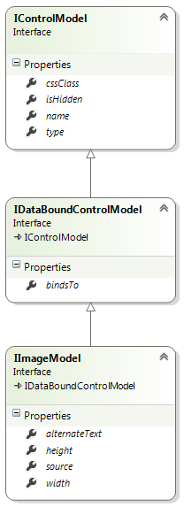
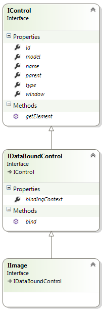

# Image Control

## Model



**type: string** - type of the control. Use _"image"_ to declare an Image control.

**name?: string** (optional) - name of the control. In javascript code, a child control is accessible from its parent control by name. In HTML, the value is put into the _name_ attribute of the element.

**cssClass?: string** (optional) - custom CSS class that will be applied to the control's outer element.

**isHidden?: boolean** (optional) - allows to declare control as hidden.

**bindsTo?: string** (optional) - path of the property that the control will be databound to.

**alternateText?: string** (optional) - alternate text. In HTML, the value is put into the _alt_ attribute of the _img_ element.

**width?: number** (optional) - image width. In HTML, the value is put into the _width_ attribute of the _img_ element.

**height?: number** (optional) - image height. In HTML, the value is put into the _height_ attribute of the _img_ element.

**source?: string**(optional) - image source uri. In HTML, the value is put into the _src_ attribute of the _img_ element.

### Example

```
{
	"name": "userImage",
	"type": "image",
	"alternateText": "User Image",
	"width": 64,
	"height": 64,
	"source": "/resources/user.png"
}
```javascript

## Control



**model: IControlModel** - reference to the model.

**id: string** - control id. Returns value of the _id_ attribute of the element.

**type: string** - type of the control.

**name: string** - name of the control.

**parent: IControl** - reference to the parent control.

**window: IWindow** - reference to the window that owns the control.

**bindingContext: any** - reference to the object that the control is bound to.

**getElement(): JQuery** - returns the HTML element that represents the control.

**bind(dataObject: any): void** - binds the control to the data model.