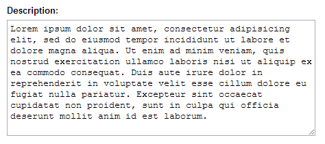
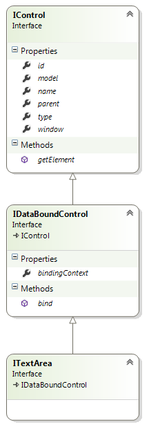

# TextArea Control



## Model


**type: string** - type of the control. Use _"textarea"_ to declare a TextArea control.

**name?: string** (optional) - name of the control. In javascript code, a child control is accessible from its parent control by name. In HTML, the value is put into the _name_ attribute of the element.

**cssClass?: string** (optional) - custom CSS class that will be applied to the control's outer element.

**isHidden?: boolean** (optional) - allows to declare control as hidden.

**bindsTo?: string** (optional) - path of the property that the control will be databound to.

**label?: string** (optional) - control label.

**columns?: number** (optional) - number of columns. In HTML, the value is put into the _cols_ attribute of the element. Default value is 80.

**rows?: number** (optional) - number of rows. In HTML, the value is put into the _rows_ attribute of the element. Default value is 10.

### Example

```javascript
{
	"name": "descriptionTextArea",
	"type": "textarea",
	"label": "Description",
	"bindsTo": "description",
	"columns": 30,
	"rows": 10
}
```

## Control



**model: IControlModel** - reference to the model.

**id: string** - control id. Returns value of the _id_ attribute of the element.

**type: string** - type of the control.

**name: string** - name of the control.

**parent: IControl** - reference to the parent control.

**window: IWindow** - reference to the window that owns the control.

**bindingContext: any** - reference to the object that the control is bound to.

**getElement(): JQuery** - returns the HTML element that represents the control.

**bind(dataObject: any): void** - binds the control to the data model.