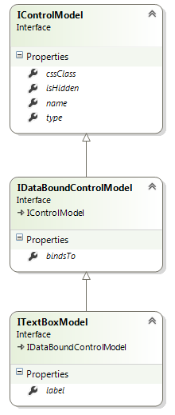

# TextBox Control

## Model

**type: string** - type of the control. Use _"textbox"_ to declare a TextBox control.

**name?: string** (optional) - name of the control. In javascript code, a child control is accessible from its parent control by name. In HTML, the value is put into the _name_ attribute of the element.

**cssClass?: string** (optional) - custom CSS class that will be applied to the control's outer element.

**isHidden?: boolean** (optional) - allows to declare control as hidden.

**bindsTo?: string** (optional) - path of the property that the control will be databound to.

**label?: string** (optional) - control label.

### Example

{code:javascript}
{
    "name": "firstNameTextBox",
    "type": "textbox",
    "label": "First Name",
    "bindsTo": "firstName"
}
{code:javascript}

## Control

**model: IControlModel** - reference to the model.

**id: string** - control id. Returns value of the _id_ attribute of the element.

**type: string** - type of the control.

**name: string** - name of the control.

**parent: IControl** - reference to the parent control.

**window: IWindow** - reference to the window that owns the control.

**bindingContext: any** - reference to the object that the control is bound to.

**getElement(): JQuery** - returns the HTML element that represents the control.

**bind(dataObject: any): void** - binds the control to the data model.

[TextBox Control Example](TextBox-Control-Example)
[TextBox Control, Override Input Type](TextBox-Control,-Override-Input-Type)

.