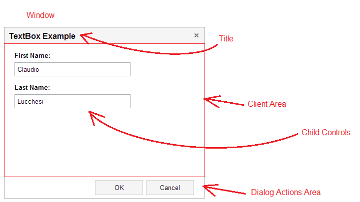
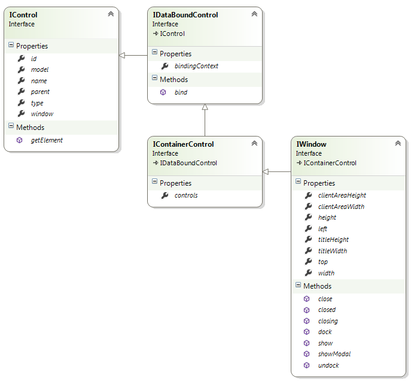

# Window

## Model

**type: string** - type of the control. For window, returns "window".

**name?: string** (optional) - name of the control. In javascript code, a child control is accessible from its parent control by name. In HTML, the value is put into the _name_ attribute of the element.

**cssClass?: string** (optional) - custom CSS class that will be applied to the control's outer element.

**isHidden?: boolean** (optional) - allows to declare control as hidden.

**controls?: IControlModel** (optional) - describes child controls that window contains.

**bindingContext?: string** (optional) - property of the data object that will be used as a binding context. When not set, the data object itself is used as a context.

**title?: string** (optional) - window title.

**left?: number** (optional) - the x coordinate of the left top corner of the window.

**top?: number** (optional) - the y coordinate of the left top corner of the window.

**width?: number** (optional) - window width.

**height?: number** (optional) - window height.

### Example

{code:javascript}
{
	"name": "TextBoxExample",
	"title": "TextBox Example",
	"left": 500,
	"top": 100,
	"width": 400,
	"height": 300,
	"controls": [
		{
			"name": "firstNameTextBox",
			"type": "textbox",
			"label": "First Name",
			"bindsTo": "firstName"
		},
		{
			"name": "lastNameTextBox",
			"type": "textbox",
			"label": "Last Name",
			"bindsTo": "lastName"
		},
		{
			"name": "OKButton",
			"type": "button",
			"text": "OK",
			"isDialogButton": true,
			"dialogResult": "OK"
		},
		{
			"name": "CancelButton",
			"type": "button",
			"text": "Cancel",
			"isDialogButton": true,
			"dialogResult": "Cancel"
		}
	]
}
{code:javascript}

## Control

**model: IControlModel** - reference to the model.

**id: string** - control id. Returns value of the _id_ attribute of the element.

**type: string** - type of the control.

**name: string** - name of the control.

**parent: IControl** - reference to the parent control.

**window: IWindow** - reference to the window that owns the control.

**bindingContext: any** - reference to the object that the control is bound to.

**controls: IControl** - array of child controls.

**left: number** - the x coordinate of the left top corner of the window.

**top: number** - the y coordinate of the left top corner of the window.

**width: number** - window width.

**height: number** - window height.

**titleWidth: number** - title width.

**titleHeight: number** - title height.

**clientAreaWidth: number** - client area width.

**clientAreaHeight: number** - client area height.

**getElement(): JQuery** - returns the HTML element that represents the control.

**bind(dataObject: any): void** - binds the control to the data model.

**show(): void** - shows the window.

**close(dialogResult?: string): void** - closes the window. All HTML that has been rendered for the window is removed from the document.

**showModal(): void** - shows the window as a modal dialog.

**dock(divSelector: JQuery): void** - docks the window into the div that is returned by divSelector.

**undock(): void** - if window is docked, undocks the window from the div. If the window is not docked, does nothing.

**closing(handler: (target: any, dialogResult: string) => void): void** - subscribes a handler to the event that is triggered before the window is closed.

**closed(handler: (target: any, dialogResult: string) => void): void** - subscribes a handler to the event that is triggered after the window is closed.

[Simple Window Example](Simple-Window-Example.md)
[Dialog Window Example](Dialog-Window-Example.md)
[Modal Dialog Window Example](Modal-Dialog-Window-Example.md)
[Custom Modal Dialog Window Example](Custom-Modal-Dialog-Window-Example.md)
[Dockable Window Example](Dockable-Window-Example.md)
[Master - Detail Example](Master---Detail-Example.md)
[Mutiple Level Nested Dialogs](Mutiple-Level-Nested-Dialogs.md)
[Validation, Required Fields](Validation,-Required-Fields.md)
[Validation, Pattern Match](Validation,-Pattern-Match.md)
[Validation, Maximum Length](Validation,-Maximum-Length.md)
[Validation, Model Validation](Validation,-Model-Validation.md)
[Validation, GridView](Validation,-GridView.md)
[Databound Custom Control Example](Databound-Custom-Control-Example.md)
[Databound Custom Control With Custom Model Properties Example](Databound-Custom-Control-With-Custom-Model-Properties-Example.md)
[Custom Container Control Example](Custom-Container-Control-Example.md)
[Simple Observable Example](Simple-Observable-Example.md)
[Computed Observable Example](Computed-Observable-Example.md)
[Observable Array Example](Observable-Array-Example.md)
[Observable TreeView Example](Observable-TreeView-Example.md)
[Ribbon Control Example](Ribbon-Control-Example.md)
[Context Menu Control Example](Context-Menu-Control-Example.md)
[Tabs Control Example](Tabs-Control-Example.md)
[ListView Control Example](ListView-Control-Example.md)
[AccordionPanel Control Example](AccordionPanel-Control-Example.md)
[Store/Restore Window State](Store_Restore-Window-State.md)